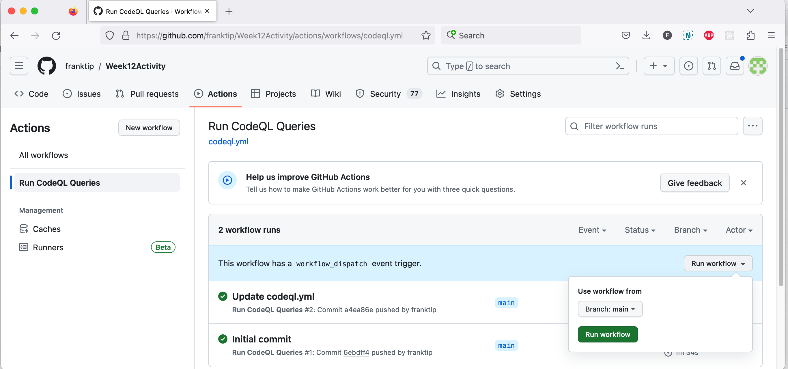

# Week 8 Activity: Static Analysis using CodeQL

In this activity, we'll be writing a few simple CodeQL queries and running them against our beloved calculator project.

## Step 1: Fork the provided template repository.

We have created a template repository at [https://github.com/neu-cs4530-fall2023/Week12-CodeQL-Activity](https://github.com/neu-cs4530-fall2023/Week12-CodeQL-Activity) that contains a version of the calculator project.


Open this repo in a browser, click on the button "Use this template", and select the option "Create a new repository".


In the dialog that pops up, select your own GitHub ID, and choose a name for the new repository (e.g., "Week12Activity" but you can choose anything you like). Make sure that the newly created repository is **public**, otherwise CodeQL will not work.

Then press the green "Create Repository" button at the bottom of the page.

## Step 2: Viewing the provided queries

The directory `.github/workflows/queries` in your repository contains a few CodeQL queries that we provided for you. 


Click on the one called `files-without-comments.ql` to inspect its contents:


Click on the other queries to inspect their contents as well.

## Step 3: Running the provided queries

We have set things up so that you can run the CodeQL queries manually and your queries are also run when you push to the main branch.

### Manually running the queries

To manually kick off a run of the CodeQL queries, please do the following:
  - go to the main page of your repository, 
  - click on the "Actions" tab
  - on the left side of the page, click on "Run CodeQL queries"
  - then on the right, click on the green "Run workflow" button (see screenshot below)



After a few moments, you'll see that a new workflow is running (see screenshot below). When the workflow has finished, a green checkmark will appear (this may take several minutes).


### Viewing the results of the queries


Click on the `Security` tab at the top of the page. Then, on the left click on `Code Scanning`. This will bring up a list of matches for the provided example queries (see below).


Clicking on each match will show the code fragment involved in the match:


## Step 4: Write your own CodeQL queries

Next, your task is to write two simple queries yourself, run them, and confirm that the results are as expected. Some examples of queries you could try to write are (in increasing level of difficulty):
  - find functions that are longer than 10 lines (hint: you can call getNumLines() on any AST node to get their length)
  - find tests that call a function called "pressActionKey" (hint: you can call getName() on a Function node to get its name, if it has one) 
  - find all public methods that are called by tests
  - find all public methods that are not called by any test
  - find all exported functions that are not called by any test
For the last three queries, you can use the following predicate to check if a function is a public method:
```
/**
 * Holds if the given function is a public method of a class.
 */
predicate isPublicMethod(Function f) {
  exists(MethodDefinition md | md.isPublic() and md.getBody() = f)
}

/**
* Holds if the given function is exported from a module.
*/
predicate isExportedFunction(Function f) {
  exists(Module m | m.getAnExportedValue(_).getAFunctionValue().getFunction() = f) and
  not f.inExternsFile()
}
``` 

You are encouraged to experiment with other queries. Please refer to CodeQL's [Library for JavaScript](https://codeql.github.com/docs/codeql-language-guides/codeql-library-for-javascript/) and list of [Abstract Syntax Tree classes](https://codeql.github.com/docs/codeql-language-guides/abstract-syntax-tree-classes-for-working-with-javascript-and-typescript-programs/).

After confirming that your queries work as expected, upload two of them via GradeScope.